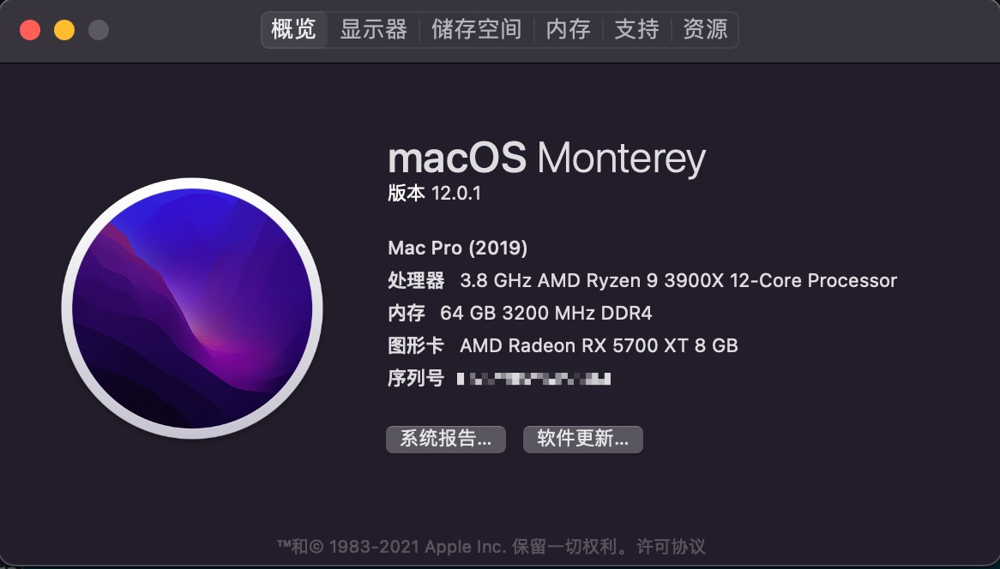
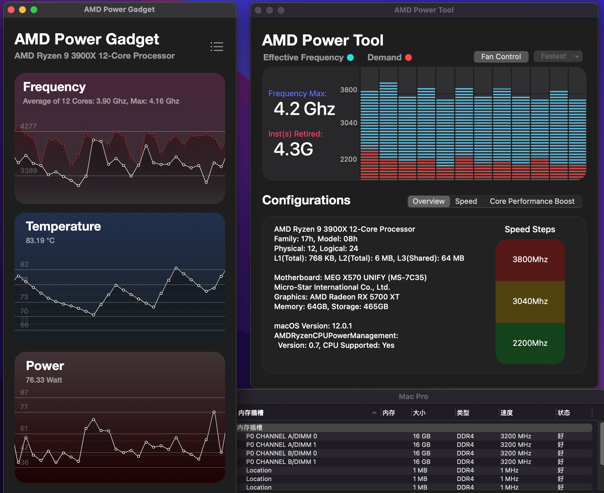
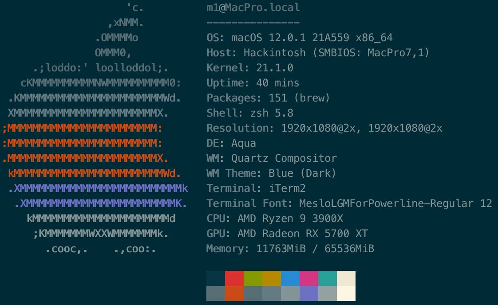
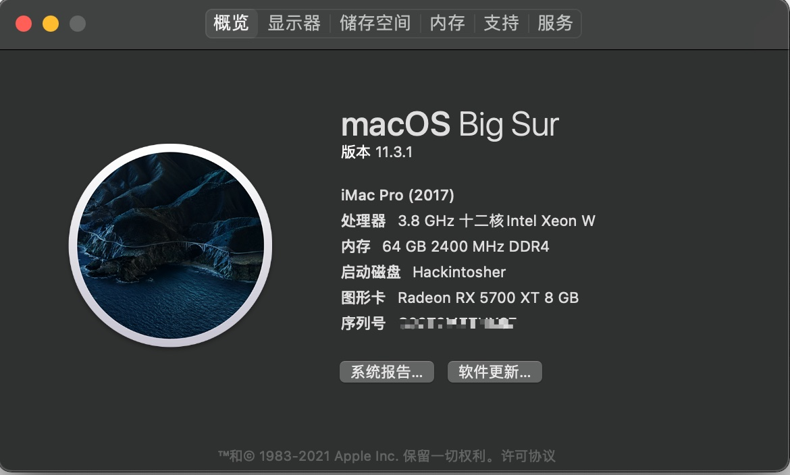
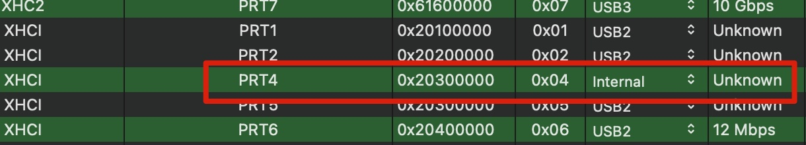

- Updated at 2021.11
- Support `Monterey 12.0.1`
- OpenCore Version `0.7.5`

> If you want use Big Sur click here [BigSur](./README-BigSur.md)

# 

- CPU: AMD R9 Ryzen 3900X
- Motherboard: (MSI)MEG X570 UNIFY
- GPU: ASUS ROG STRIX Radeon RX5700XT O8G GAMING
- Wireless Card: PCI-E BCM94360CD (FV-T919)
- Other:
  - RAM: Kingston Fury DDR4 3200 16Gx4
  - SSD: SAMSUNG 970 EVO Plus 500GB(M.2/Nvme)
  - Monitor: BenQ PD2700U & Dell P2415Q

Based on [barrrrt/AMD-3900x_MEG-MSI-Unify-X570_AMD-X5700XT](https://github.com/barrrrt/AMD-3900x_MEG-MSI-Unify-X570_AMD-X5700XT)

And [awesometic/hackintosh-gigabyte-x570-aorus-elite](https://github.com/awesometic/hackintosh-gigabyte-x570-aorus-elite)

> I use PCI-E Wireless Card, so I disabled the internel WIFI Intel AX200
>
> Find `USBPorts.kext`, open Contents/Info.plist, and remove which key is  `PRT4` and its node `dict`
>
> then it becomes Unknown

**Attention**: Don't forget regenerate your Seria Number. Use [GenSMBIOS](https://github.com/corpnewt/GenSMBIOS)

If you have memory issue, follow this [Fixing MacPro7,1 Memory Errors](https://dortania.github.io/OpenCore-Post-Install/universal/memory.html#fixing-macpro7-1-memory-errors)

