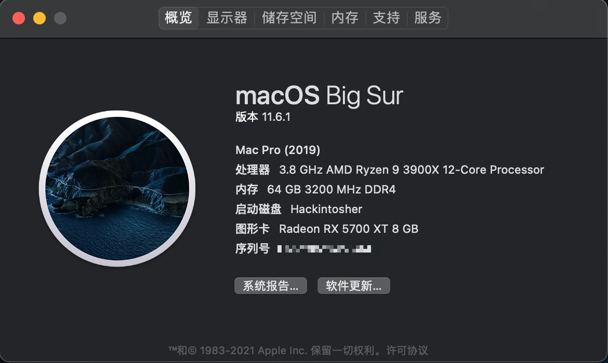
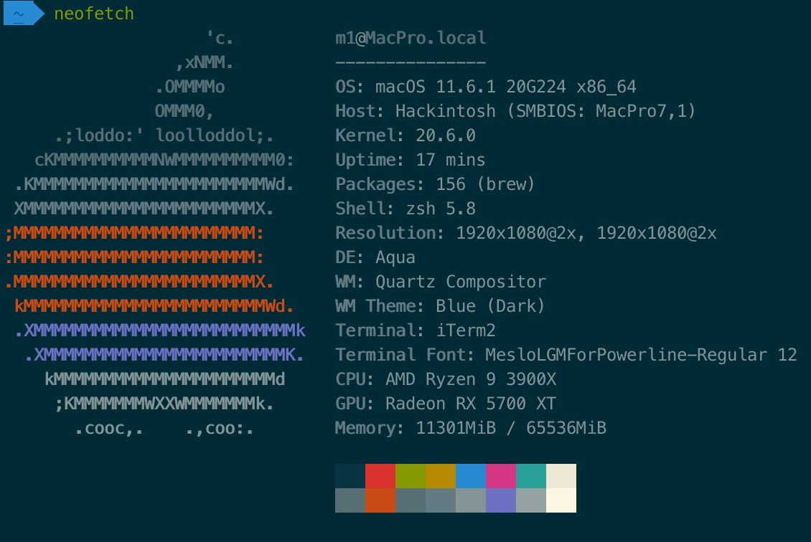
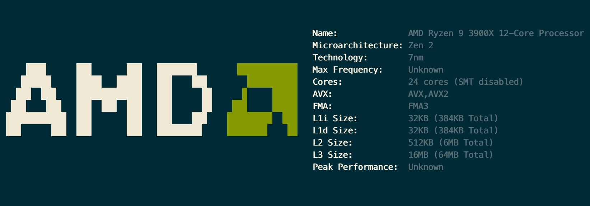
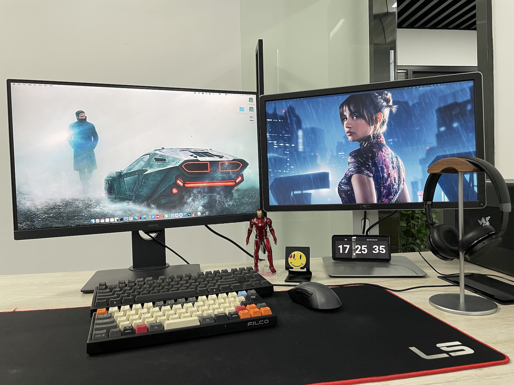

- Updated at 2021.11
- Support `Big Sur 11.6.1`
- OpenCore Version `0.7.5`

# 

- CPU: AMD R9 Ryzen 3900X
- Motherboard: (MSI)MEG X570 UNIFY
- GPU: ASUS ROG STRIX Radeon RX5700XT O8G GAMING
- Wireless Card: PCI-E BCM94360CD
- Other:
  - RAM: Kingston Fury DDR4 3200 16Gx4
  - SSD: SAMSUNG 970 EVO Plus 500GB(M.2/Nvme)
  - Monitor: BenQ PD2700U & Dell P2415Q

Based on [barrrrt/AMD-3900x_MEG-MSI-Unify-X570_AMD-X5700XT](https://github.com/barrrrt/AMD-3900x_MEG-MSI-Unify-X570_AMD-X5700XT)

> I use PCI-E Wireless Card, so I disabled the internel WIFI Intel AX200
>
> Find `USBPorts.kext`, open Contents/Info.plist, and remove which key is  `PRT4` and its node `dict`
>
> then it becomes Unknown

**Attention**: Don't forget regenerate your Seria Number. Use [GenSMBIOS](https://github.com/corpnewt/GenSMBIOS)

**Problem**: Could not upgrade to Monterey, I am still trying hard.
